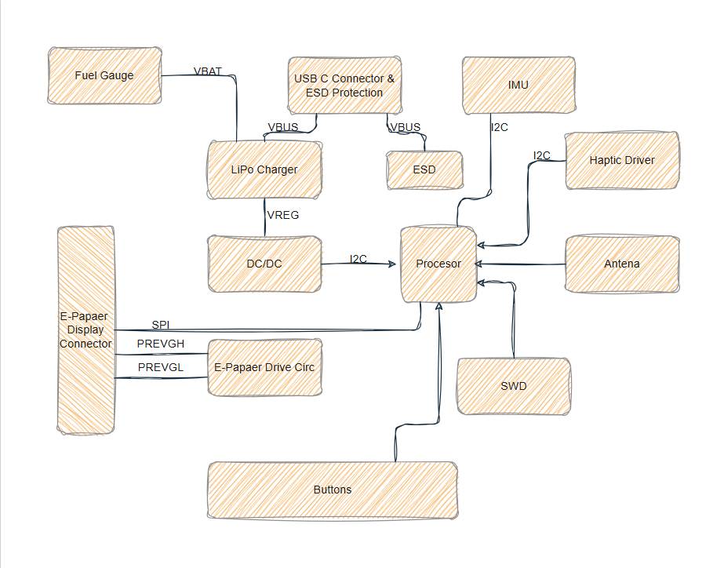

<small>Copyright @Tudor Brandibur 2025-2026</small>

# Outer Watch

This repository contains the project for Outer_Watch, a smart watch based on the nRF52840 microcontroller, designed for power efficiency and Bluetooth Low Energy (BLE) connectivity.

## 1. Block diagram

## 2. BOM
| Designator | Qty | Component | Package | Description | Part number | Datasheet/Link |
| :--- | :---: | :--- | :--- | :--- | :--- | :--- |
| U1 | 1 | nRF52840 | aQFN-73 | Main Bluetooth 5.4 SoC | [C190733](https://www.lcsc.com/product-detail/C190733.html) | [View](https://www.lcsc.com/product-detail/C190733.html) |
| IC1 | 1 | BQ25180YBGR | DSBGA-8 | Battery Charge Management IC | [C5186637](https://www.lcsc.com/product-detail/C5186637.html) | [View](https://www.lcsc.com/product-detail/C5186637.html) |
| IC9 | 1 | RT6160AWSC | WL-CSP-15 | High-Efficiency Buck-Boost | [C464871](https://www.lcsc.com/product-detail/C464871.html) | [View](https://www.lcsc.com/product-detail/C464871.html) |
| IC3 | 1 | BMA423 | LGA-12 | 3-axis Accelerometer | [C128221](https://www.lcsc.com/product-detail/C128221.html) | [View](https://www.lcsc.com/product-detail/C128221.html) |
| U3 | 1 | MAX17048G+T10 | TDFN-8 | Battery Fuel Gauge | [C51509](https://www.lcsc.com/product-detail/C51509.html) | [View](https://www.lcsc.com/product-detail/C51509.html) |
| IC2 | 1 | DRV2605YZFR | DSBGA-9 | Haptic Driver | [C60367](https://www.lcsc.com/product-detail/C60367.html) | [View](https://www.lcsc.com/product-detail/C60367.html) |
| J4 | 1 | KH-TYPE-C-16P | SMD | USB-C 16-Pin Connector | [C3111425](https://www.lcsc.com/product-detail/C3111425.html) | [View](https://www.lcsc.com/product-detail/C3111425.html) |
| J1 | 1 | 503480-2400 | SMD | 24-Pin FPC Connector | [C193568](https://www.lcsc.com/product-detail/C193568.html) | [View](https://www.lcsc.com/product-detail/C193568.html) |
| ANT1 | 1 | 2450AT18B100E | 1206 | 2.4GHz Chip Antenna | [C96245](https://www.lcsc.com/product-detail/C96245.html) | [View](https://www.lcsc.com/product-detail/C96245.html) |
| D3 | 1 | USBLC6-2SC6Y | SOT-23-6 | ESD Protection | [C314115](https://www.lcsc.com/product-detail/C314115.html) | [View](https://www.lcsc.com/product-detail/C314115.html) |
| Q1 | 1 | DMG2305UX-7 | SOT-23 | P-Channel MOSFET | [C131015](https://www.lcsc.com/product-detail/C131015.html) | [View](https://www.lcsc.com/product-detail/C131015.html) |
| Q3 | 1 | SI1308EDL-T1-GE3 | SOT-323 | N-Channel MOSFET 30V | [C139044](https://www.lcsc.com/product-detail/C139044.html) | [View](https://www.lcsc.com/product-detail/C139044.html) |
| D2, D4, D5 | 3 | MBR0530 | SOD-123 | Schottky Rectifier | [C2053](https://www.lcsc.com/product-detail/C2053.html) | [View](https://www.lcsc.com/product-detail/C2053.html) |
| X1 | 1 | ABM11-27MHz | 2016 | 27MHz HF Crystal | [C529322](https://www.lcsc.com/product-detail/C529322.html) | [View](https://www.lcsc.com/product-detail/C529322.html) |
| X2 | 1 | LFXTAL061361 | 3215 | 32.768kHz RTC Crystal | [C104780](https://www.lcsc.com/product-detail/C104780.html) | [View](https://www.lcsc.com/product-detail/C104780.html) |
| L7 | 1 | MLP2016SR47M | 0806 | 0.47uH Power Inductor | [C45943](https://www.lcsc.com/product-detail/C45943.html) | [View](https://www.lcsc.com/product-detail/C45943.html) |
| L5 | 1 | 744043680 | SMD | 68uH Shielded Inductor | [C19438](https://www.lcsc.com/product-detail/C19438.html) | [View](https://www.lcsc.com/product-detail/C19438.html) |
| L2, L3 | 2 | ATFC-0402-3N3 | 0402 | 3.3nH High Q Inductor | [C529323](https://www.lcsc.com/product-detail/C529323.html) | [View](https://www.lcsc.com/product-detail/C529323.html) |
| R-Group | 15 | CPF0201D7K68C1 | 0201 | Precision Resistors | [C420120](https://www.lcsc.com/product-detail/C420120.html) | [View](https://www.lcsc.com/product-detail/C420120.html) |
| C-0402 | 25 | C0402C333J4REC | 0402 | MLCC Capacitors | [C418932](https://www.lcsc.com/product-detail/C418932.html) | [View](https://www.lcsc.com/product-detail/C418932.html) |
| C-0201 | 26 | 02016D105KAT2A | 0201 | X5R 1.0uF Capacitors | [C293021](https://www.lcsc.com/product-detail/C293021.html) | [View](https://www.lcsc.com/product-detail/C293021.html) |
| C-Ultra | 4 | GRM011R60J152 | 01005 | Ultra-Small Capacitors | [C293022](https://www.lcsc.com/product-detail/C293022.html) | [View](https://www.lcsc.com/product-detail/C293022.html) |

## 3. Hardware Description

#### Modules and Functionality
Microcontroller (SoC): nRF52840 (Cortex-M4F at 64MHz). It offers native support for USB, Bluetooth 5, and ultra-low power consumption in sleep modes.

#### Sensors
Integrated motion sensor (IMU) for features like "Lift to Wake" and step counting.

#### Power Management
Battery charging is handled by the TP4056 circuit powered via USB-C. Voltage is regulated to 3.3V through the RT9193 LDO regulator.

#### Communication Interfaces
I2C: Used for the Display and IMU (Standard 400kHz speed).

SWD: Programming and debugging interface (SWDIO and SWDCLK pins).

USB: For charging and data communication/DFU.

### Power Consumption (Estimation)
Deep Sleep (System OFF): ~3uA (nRF52840) + ~2uA (IMU sleep) = ~5uA.

Active Mode (Screen ON + BLE): ~15mA - 20mA.

Battery Life: With a 200mAh battery, under mixed usage, the watch can operate between 5 to 10 days.

## 4. Hardware Mapping & Pin Configuration
The nRF52840 acts as the central brain. Below is the pin allocation strategy used to balance signal integrity, power consumption, and peripheral speed.
1. Communication Buses (I2C & SPI)

- Display (SPI): P0.17 (SCK), P0.20 (MOSI), P0.15 (CS), P0.22 (DC), P0.24 (RST)
- Sensors & Power (I2C): P0.26 (SDA), P0.27 (SCL)

2. Specialized Integrated Circuits (ICs)

- BMA423 (Accelerometer): P0.11 (INT1): Used for Wake-on-Motion. This allows the nRF52840 to stay in "System ON" low-power mode until a wrist tilt or tap is detected.

- MAX17048 (Fuel Gauge): 0.26/P0.27: Reads battery VCELL and SOC (State of Charge). No external sense resistor is needed due to the ModelGauge algorithm.

- BQ25180 (Charger): P0.13 (INT): Signals charging status changes (cable connected, charging complete).

- DRV2605L (Haptic Driver): P0.14 (EN): Enables the chip. Controlled via I2C to trigger complex ERM/LRA vibration patterns for notifications.

3. Power & Interaction
- Navigation Switches (SW_UP, SW_DW, SW_ENT): P1.02, P1.04, P1.06: Connected to GPIOs with internal Pull-Up resistors. These pins on Port 1 are used to keep Port 0 free for high-speed serial traces.

- USB Interface: D+ / D-: Dedicated hardware pins on the nRF52840. Used for the USB stack (CDC/MSC) without consuming standard GPIOs.

4. RF & Clock (Critical Traces)

- 2.4GHz Antenna: ANT

- HF Crystal (27MHz): XC1, XC2

- LF Crystal (32.768kHz): P0.00, P0.01